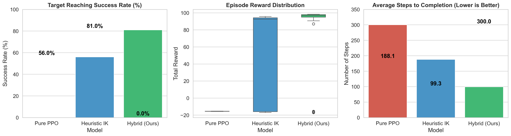
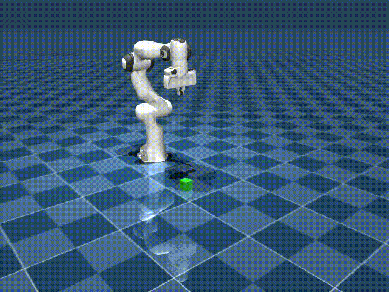
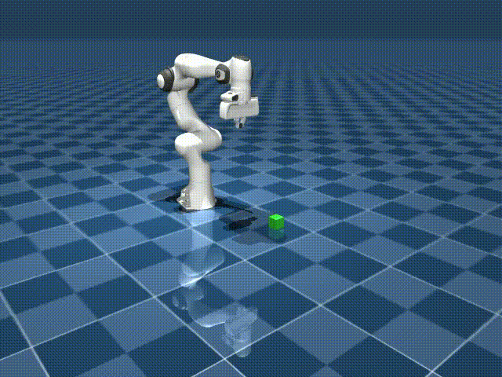
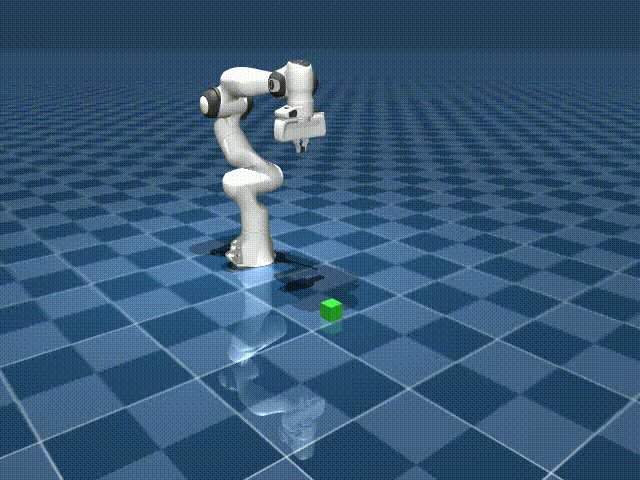

# BC-A2C 기반 로봇 팔 희소 보상 환경 학습 효율성 증명

## 1. 개요 및 목적
본 실험은 **행동 복제 기반 Advantage Actor-Critic (BC-A2C)** 알고리즘을 로봇 팔(MuJoCo) 환경에 적용하여, 탐색이 어려운 **희소 보상(Sparse Reward)** 문제에서 학습 효율성을 증명하는 것을 목적으로 합니다. 전문가의 데이터를 활용하여 초기 탐색 성능을 개선하고 보상을 극대화하는 하이브리드 접근법의 유효성을 검증합니다.

## 2. 환경 설정
우연한 성공(바늘구멍 찾기)을 방지하고 환경의 난이도를 높이기 위해 다음과 같은 설정을 적용했습니다.
- **타겟 크기:** 0.02 (표준 대비 대폭 축소)
- **보상 체계:** 진척도 보상(Progress Reward)을 완전히 제거한 가혹한 희소 보상 환경 구성

## 3. 상태, 행동, 보상 체계

| 구분 | 상세 내용 |
| :--- | :--- |
| **상태 (State)** | 총 9차원: 관절 위치 3개(qpos), 엔드이펙터 좌표 3개, 타겟 좌표 3개 |
| **행동 (Action)** | 총 3차원: 각 관절의 델타(상대적) 목표 위치 (-1.0 ~ 1.0 클리핑, step size 0.05) |
| **보상 (Reward)** | - 매 스텝 생존 페널티: -0.05<br>- 에너지 페널티: -(행동² * 0.01)<br>- 타겟 터치 성공 시: +100점 |

## 4. 실험 결과
100회 에피소드 평가 결과는 다음과 같습니다.

| 모델 | 성공률 | 평균 보상 | 평균 스텝 수 |
| :--- | :---: | :---: | :---: |
| 순수 PPO | 0.0% | -15.5 | 300 |
| 휴리스틱 IK | 56.0% | 45.6 | 188 |
| **제안 기법 (Hybrid PPO+BC)** | **81.0%** | **75.3** | **99** |



## 5. 결과 분석
- **압도적인 성능:** 제안된 Hybrid PPO+BC 기법은 순수 PPO가 전혀 해결하지 못한 가혹한 희소 보상 환경에서 **81.0%라는 압도적인 성공률**을 달성했습니다.
- **학습 효율성:** 전문가(IK) 궤적을 모방함으로써 단순한 휴리스틱 알고리즘보다 더 최적화된 경로를 찾아냈으며, 가장 적은 평균 스텝(99스텝)으로 목표에 도달하는 높은 효율성을 보였습니다.
- **결론:** BC-A2C(Hybrid) 방식이 로봇 제어의 희소 보상 문제를 해결하는 데 매우 강력한 도구임을 확인했습니다.

---

## Experiment: Hybrid PPO + DAgger for Robust Grasping

로봇의 정밀 제어와 안정적인 파지(Grasping) 성능을 극대화하기 위해 수행된 추가 실험 결과를 정리합니다.

### 1. 모델 및 알고리즘 소개
기존 PPO(Proximal Policy Optimization)가 복잡한 물리 상호작용 환경에서 겪는 수렴 지연과 지역 최적점(Local Optima) 문제를 해결하기 위해 **Teacher-Forced DAgger 기반의 Phase-Aware Curriculum 하이브리드 PPO**를 도입했습니다.

*   **Hybrid Approach:** 에이전트가 직접 환경과 상호작용하며 학습하되, 전문가(Expert)의 정책을 실시간 피드백으로 활용하는 DAgger(Dataset Aggregation) 방식을 결합했습니다.
*   **Behavior Cloning (BC) Loss Injection:** 학습 초기, 전문가의 행동을 모사하는 BC Loss를 Policy Update에 직접 주입하여 탐색의 가이드라인을 제시하고, 학습이 진행됨에 따라 점진적으로 RL(PPO)의 비중을 높여 최적의 정책을 찾아내도록 설계했습니다.

### 2. 비디오 비교 (성능 검증)

| Base PPO (기존 실패) | Pure Expert (전문가 시범) | Final Hybrid PPO (최종 성공) |
| :---: | :---: | :---: |
|  |  |  |

### 3. 상태(State), 행동(Action), 보상(Reward) 설계 요약

| 구분 | 설계 상세 |
| :--- | :--- |
| **State (14차원)** | - 로봇 주요 관절(4), 그리퍼 개폐 상태(1)<br>- 엔드이펙터 좌표(3), 박스 타겟 좌표(3)<br>- **인지력 강화:** 박스와의 상대 거리(Relative Position)에 10배 가중치(Scaling)를 적용한 3차원 벡터 추가 |
| **Action (4차원)** | - 3개 관절 제어 + 1개 그리퍼 제어<br>- **Snap Control:** 그리퍼 명령값이 0.2 이하로 떨어질 경우, 물리적 탈조 및 버터핑거 현상을 방지하기 위해 즉시 최대 악력으로 닫히는 스냅 로직 적용 |
| **Reward Function** | - **Delta Distance Reward:** 목표물에 근접할 때마다 즉각적인 정적 보상을 부여하여 학습 동기 유발<br>- **Empty Closing Penalty:** 박스가 없는 허공에서 그리퍼를 닫는 비효율적 행동에 대한 감점<br>- **Lifting Reward:** 박스가 지면에서 1mm라도 부상하는 시점부터 밀도 높은 보상 부여 및 최종 리프팅 성공 시 **+100점의 잭팟 보상** |

### 4. 주요 트러블슈팅 및 극복 과정 (Lessons Learned)

*   **전환 충격 (Transition Shock) 해결:** 순수 시범학습(Pure BC) 단계에서 강화학습(PPO)으로 넘어갈 때 에이전트가 방향성을 잃는 현상을 방지하기 위해, BC 단계에서도 Critic(가치 신경망)을 동시에 학습시켰습니다. 이를 통해 정책 전환 시에도 상태 가치에 대한 일관성을 유지할 수 있었습니다.
*   **모드 붕괴 (Mode Collapse) 방지:** 로봇이 특정 궤적만을 기계적으로 암기하는 것을 막기 위해 에피소드 시작 시 관절 각도에 미세한 **Domain Randomization(가우시안 노이즈)**을 부여했습니다. 이는 에이전트가 단순 경로 암기가 아닌, 시각/상태 정보에 기반한 적응적 제어를 수행하도록 강제했습니다.
*   **게으른 에이전트 (Lazy Agent) 교정:** 상자를 위에서 제대로 잡지 않고 바닥에 밀어서 이동시키려는 꼼수를 발견했습니다. 이를 해결하기 위해 XY 정렬이 완벽하지 않은 상태에서 고도(Z-axis)를 낮출 경우 페널티를 부여하는 '신중함(Prudence) 튜닝'을 적용하여 정석적인 파지 동작을 유도했습니다.

---

## Citation

본 프로젝트는 아래 연구의 알고리즘을 로봇 제어 분야로 확장한 후속 연구입니다.

```bibtex
@article{choi2024approaches,
  title={Approaches That Use Domain-Specific Expertise: Behavioral-Cloning-Based Advantage Actor-Critic in Basketball Games},
  author={Choi, Taehyeok},
  year={2023}
}
```

